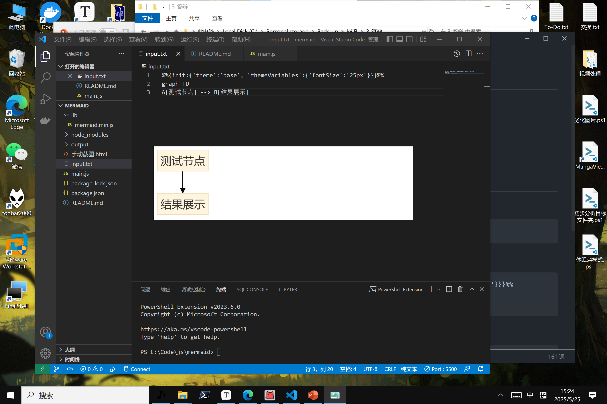

# Mermaid转图方案

由于在线网页提供的mermaid自定义配置困难，遂开发此方案。



## 功能

Node.js实现

- 运行后输出png和svg图片。
- 支持强制自定义配置。

## 使用方法
- 安装依赖
```bash
npm install puppeteer fs-extra
```
- 在input.txt中填入mermaid代码。示例：
```text
%%{init:{'theme':'base', 'themeVariables':{'fontSize':'25px'}}}%%
graph TD
A[测试节点] --> B[结果展示]
```

- 运行脚本后,即可查看生成的png和svg。
```bash
node main.js
```

- 若init配置未生效，则添加以下类似代码来进行自定义配置
```html
<style>
    .mermaid text {
        font-size: 24px !important;
        font-family: "Microsoft Yahei" !important;
        }
    .mermaid .node text {
        font-size: 24px !important;
    }
    .mermaid {
        background: white;
    }
</style>
```

##  贡献指南

欢迎通过Issue提交建议或PR贡献代码，请遵循以下规范：

1. 使用 Conventional Commits 提交信息
2. 单元测试覆盖率保持90%+
3. 文档更新同步进行

##  许可证

本项目采用 MIT License，保留署名权利。
